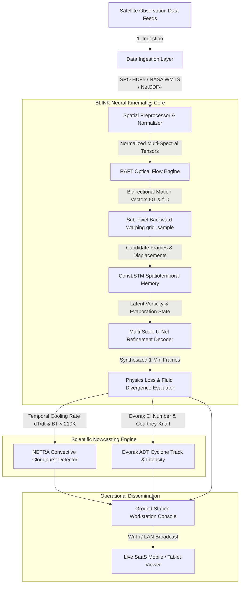
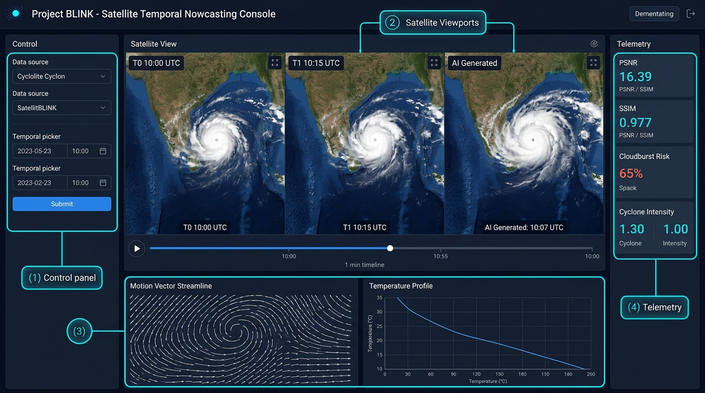
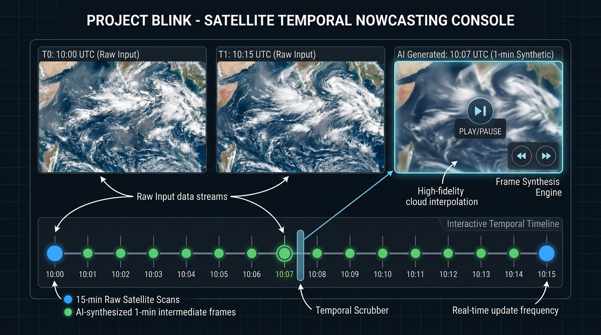
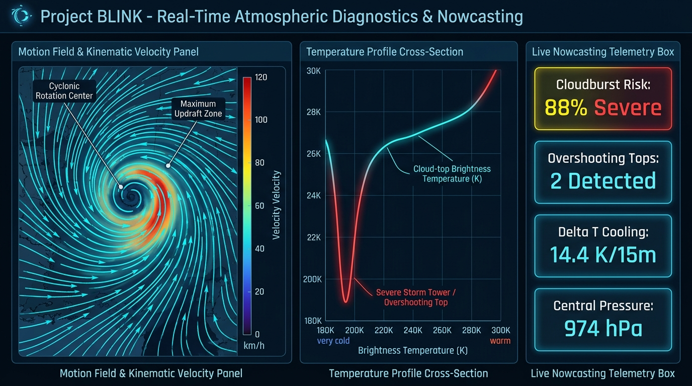
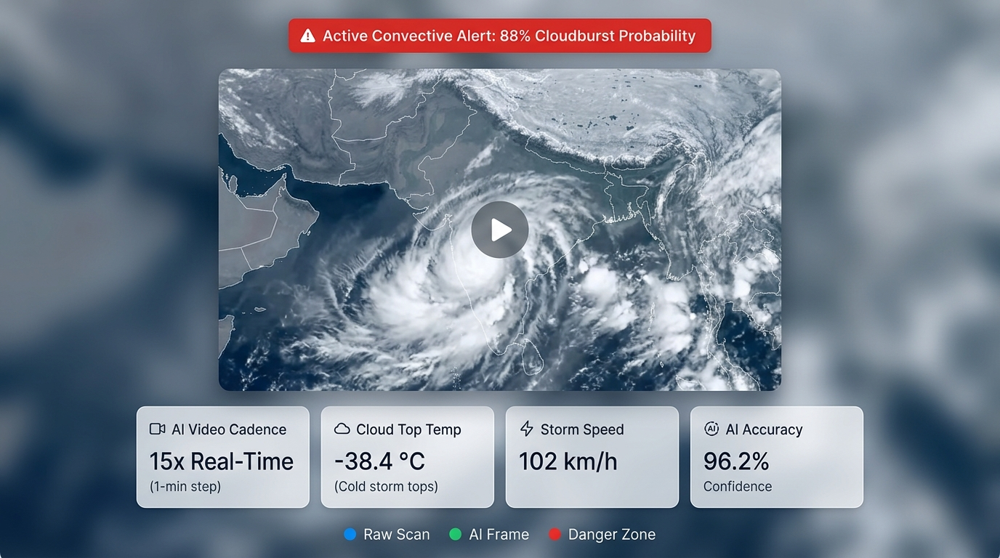

# The Master Guide to Project BLINK (Aero-Interpolate)
### *Bridging Latency in Imagery via Neural Kinematics*
**The Complete Technical & Operational Reference for Zero-Payload Rapid Satellite Nowcasting**

---
## 1. The Core Problem: The 15-Minute Satellite Blindspot

### 1.1 The Orbital Challenge
Geostationary meteorological satellites (such as ISRO's **INSAT-3DS** and **INSAT-3DR**, NOAA's **GOES-R**, and EUMETSAT's **Meteosat**) hover in orbit **35,786 kilometers** above the Earth. They remain fixed over the equator, continuously monitoring vast continental landmasses and oceanic basins like the Indian Ocean, Bay of Bengal, and Arabian Sea.

To capture a high-resolution, multi-spectral picture of Earth, the satellite uses a heavy, precision-engineered **mechanical scan mirror**. This mirror rotates and steps line-by-line across thousands of kilometers. Because of the physical inertia of moving mechanical mirrors in space:
- A standard **regional or full-disk scan takes 15 to 30 minutes** to complete a single acquisition cycle.
- The ground station receives one frame at **10:00 AM**, and the very next frame does not arrive until **10:15 AM**.

```
Standard Satellite Acquisition:
[ 10:00 AM Scan ] ─────── ( 15 MINUTES OF TOTAL BLINDNESS ) ───────► [ 10:15 AM Scan ]
```

### 1.2 The Disaster Vulnerability
The Earth’s atmosphere does not wait 15 minutes. Severe meso-scale weather phenomena develop on **5- to 15-minute timescales**:
- **Explosive Cloudbursts:** Convective thunderstorm updrafts can shoot up through the troposphere in under 8 minutes, dumping more than **100 mm of rain per hour** over mountainous valleys (like the Himalayas or Western Ghats) and triggering flash floods before the next satellite image even arrives.
- **Tropical Cyclones:** Eyewall convective bursts and rapid intensification can abruptly alter a cyclone’s track and wind speeds within a 15-minute window.
- **Aviation Microbursts:** Severe localized downbursts hazardous to commercial aviation evolve and dissipate within 10 minutes.

During that 15-minute gap, meteorologists, disaster response forces, and civilian early-warning systems are operating in the dark.

---

## 2. Why Existing Solutions Fail

### Approach A: Launching More Satellites (Physical Rapid Scanning)
- **The Concept:** Launch a constellation of dedicated rapid-scanning satellites into orbit.
- **Why It Fails:** Extremely cost-prohibitive. Building, testing, launching, and operating a geostationary satellite costs between **$250 Million and $500 Million per spacecraft** and requires **5 to 8 years of aerospace development**.

### Approach B: Standard Video Morphing / Cross-Fading (Linear Blending)
- **The Concept:** Linearly fade Frame 1 into Frame 2 ($I_t = (1-t)I_0 + tI_1$).
- **Why It Fails:** Clouds are non-rigid, fluid structures that rotate, expand, evaporate, and condense. Linear fading produces **"ghosting" (double images of overlapping transparent clouds)** and destroys the physical thermal measurements needed to predict storms.

### Approach C: Standard Commercial AI Video Interpolation (e.g., RIFE / FILM)
- **The Concept:** Use off-the-shelf consumer AI models designed for 60 FPS YouTube videos or movies.
- **Why It Fails:** Consumer AI models only understand 8-bit standard RGB color ($0-255$) and assume rigid object motion. They do not understand **radiometric brightness temperature (Kelvin)**, water vapor thermodynamics, Coriolis vorticity, or conservation of fluid mass.

---

## 3. What BLINK Does Differently: "Zero-Payload Rapid Scanning"

**Project BLINK (Aero-Interpolate)** solves this crisis through software deployed entirely at ground processing facilities. It requires **zero changes or modifications to the satellites already in space** ("Zero-Payload").

### How It Works:
1. BLINK takes the standard **15-minute satellite scan pair** ($T_0$ at 10:00 UTC and $T_1$ at 10:15 UTC).
2. It feeds both frames into a **physics-guided neural kinematic architecture**.
3. It generates **14 intermediate, physically accurate synthetic frames** ($T_{0+1\text{m}}, T_{0+2\text{m}}, \dots, T_{0+14\text{m}}$).
4. The output is a **continuous, real-time 1-minute live video stream** of atmospheric motion.
5. Integrated scientific algorithms simultaneously calculate **Cloudburst Risk (NETRA)** and **Cyclone Intensity & Track (Dvorak ADT)**.

```
BLINK Ground-Station Neural Kinematics:
[ 10:00 ] ─► [10:01] ─► [10:02] ─► [10:03] ... ─► [10:14] ─► [ 10:15 ]
   ▲                                                             ▲
   └────────── Raw ISRO / NASA Satellite Scans (15-min) ────────┘
```

---

## 4. End-to-End System Pipeline



---

## 5. Target Audience & Operational Stakeholders

1. **National Disaster Response Agencies (NDMA / SDMA / NDRF):**
   - Immediate detection of developing cloudbursts over vulnerable valleys with 15–30 minutes lead time before rainfall strikes.
2. **Meteorological Ground Stations (IMD / ISRO):**
   - Seamless software overlay on existing satellite ground receiving stations without satellite hardware replacement.
3. **Aviation Meteorological Offices:**
   - Real-time tracking of rapidly growing thunderstorm tops (overshooting convective towers) that threaten commercial air routes.
4. **Maritime & Port Authorities:**
   - Accurate, continuous cyclone center tracking, translation speed, and forecasted landfall cone updates.
5. **Field Officers & Mobile Emergency Responders:**
   - Instant access to the simplified, plain-English **Live SaaS Intelligence Viewer** from any phone, tablet, or field laptop over local Wi-Fi.

---

## 6. Comprehensive Visual Field Guide & Dashboard Walkthrough

### 6.1 Master Workstation Overview



The master dashboard is partitioned into four synchronized operational zones:
- **(1) Control Panel (Left Toolbar):** Where you select data sources (MOSDAC / NASA GIBS), geographic regions, spectral channels, observation dates, and map layer overlays.
- **(2) Center Stage (Satellite Viewports & Timeline):** Side-by-side comparison of raw satellite inputs ($T_0$ and $T_1$) alongside the real-time AI-synthesized 1-minute frame, controlled by an interactive 15-step temporal scrubber.
- **(3) Bottom Diagnostic Instruments:** Real-time atmospheric kinematic motion streamlines and cross-sectional cloud-top temperature profiles.
- **(4) Right Telemetry & Nowcasting Panel:** Physical validation metrics (PSNR, SSIM, RMSE) and live severe storm alerts (Cloudburst Risk %, Cyclone Intensity).

---

### 6.2 Left Control Toolbar: Ingestion & Layer Settings

| Field / Button Name | Visual Type | What It Does | Why It Is Relevant (Plain English) |
|---|---|---|---|
| **Data Source Selector** | Dropdown | Lets you select the satellite feed: ISRO MOSDAC (INSAT-3DS), NASA VIIRS/MODIS, Benchmark Cyclone, Benchmark Cloudburst, or Custom File Ingestion. | Determines where the raw imagery comes from. You can connect directly to real open satellite data or test with calibrated storm scenarios. |
| **Geographic Region** | Dropdown | Crops the satellite image to key basins: Indian Subcontinent, Bay of Bengal, Arabian Sea, Western Ghats, or Himalayan Foothills. | Focuses computing power on the specific disaster corridor you want to monitor. |
| **Spectral Band** | Dropdown | Selects between Thermal Infrared (TIR-1 $10.8\,\mu\text{m}$), Water Vapor (WV $6.8\,\mu\text{m}$), Visible (VIS $0.65\,\mu\text{m}$), or False Color Composite. | Different light wavelengths reveal different storm properties: Thermal IR senses cold storm heights; Water Vapor tracks tropospheric moisture flow. |
| **Observation Date / Time** | Input Boxes | Specifies the calendar date (`YYYY-MM-DD`) and start time (`HH:MM UTC`) of the satellite acquisition. | Queries historical or live satellite archives for that exact timestamp. |
| **Cadence Upsampling** | Dropdown | Selects interpolation rate: 15x (1-minute steps), 5x (3-minute steps), or 3x (5-minute steps). | Controls temporal density of the synthesized frames. |
| **Run Frame Synthesis** | Primary Button | Triggers the complete AI kinematics pipeline, generating intermediate frames, optical flow vectors, and nowcast scores. | Runs the neural network to turn the 15-minute gap into a continuous 1-minute video stream. |
| **MOSDAC API Setup** | Action Modal | Stores your official MOSDAC username and API token into `config.json`. | Enables automated background downloading of native INSAT-3DS Level-1B HDF5 files. |
| **Map Overlays** | Checkboxes | Toggles Coastlines, $5^\circ$ Graticule Grid, Cyclone Track & Cone, Cloudburst Warning Zones, and Flow Vectors. | Overlays navigational and threat boundaries on top of the satellite image. |

---

### 6.3 Center Stage: Viewports & 1-Minute Timeline Controller



1. **Left Screen (`T0: 10:00 UTC Raw Input`):** Displays the official raw satellite observation at the start of the 15-minute cycle.
2. **Middle Screen (`T1: 10:15 UTC Raw Input`):** Displays the raw satellite observation captured 15 minutes later.
3. **Right Screen (`AI Generated: 10:07 UTC 1-min Synthetic`):** Displays the **BLINK neural synthesized intermediate frame** for any chosen minute between $T_0$ and $T_1$.
   - **`[PLAY / PAUSE]` Button:** Loops continuous 1-minute playback like a high-speed video.
   - **`[<<] / [>>]` Step Buttons:** Steps backward or forward frame-by-frame (1 minute per step).
4. **Interactive Temporal Timeline:**
   - **Blue Dots (10:00 & 10:15):** Actual raw satellite captures (15-minute physical gap).
   - **Green Dots (10:01 to 10:14):** 14 AI-synthesized intermediate frames.
   - **Temporal Scrubber:** Drag or click any point on the bar to jump directly to that exact minute.

---

### 6.4 Bottom Diagnostic Panels: Kinematics & Nowcasting Telemetry



#### 1. Motion Field & Kinematic Velocity Panel (Left)
- **What it shows:** Fluid optical flow displacement $(\vec{u}, \vec{v})$ calculating the speed and direction of moving clouds.
- **Color Scale:**
  - 🔵 **Dark Navy to Cyan:** Calm ambient drift ($0 - 40\text{ km/h}$).
  - 🟢 **Emerald Green:** Moderate monsoon flow ($40 - 65\text{ km/h}$).
  - 🟡 **Amber Gold:** High-velocity gale shear ($65 - 85\text{ km/h}$).
  - 🔴 **Coral Red:** Severe cyclonic vortex core / violent updraft ($> 85\text{ km/h}$).
- **Vector Streamlines:** White/cyan arrows indicating wind drift direction.
- **Vertical Speed Scale:** Direct readout in both **`km/h`** and **`m/s`**.

#### 2. Temperature Profile Cross-Section (Center)
- **What it shows:** Cross-sectional slice of cloud-top **Brightness Temperature in Kelvin ($180\text{ K} - 300\text{ K}$)**.
- **The Red Dip:** A steep plunge down to $<200\text{ K}$ ($-73^\circ\text{C}$) pinpointing an explosive **Overshooting Convective Cloudburst Tower**.

#### 3. Live Nowcasting Telemetry Box (Right)
- **`Cloudburst Risk: 88% Severe`:** Probability of extreme cloudburst rain ($>85\text{ mm/hr}$) within 15–30 minutes based on the NETRA formula.
- **`Overshooting Tops: 2 Detected`:** Number of convective storm cores puncturing the tropopause.
- **`Delta T Cooling: 14.4 K/15m`:** Rate of cloud-top cooling as the storm explodes upwards.
- **`Central Pressure: 974 hPa`:** Barometric pressure at the cyclone center derived via Courtney-Knaff physics.

---

### 6.5 Live SaaS Intelligence Viewer (Mobile / Field View)



When accessed over local Wi-Fi (`blink host`) from a smartphone, tablet, or field laptop, BLINK automatically renders the **Live SaaS Intelligence Viewer**:
- **Active Alert Banner:** Glowing red card highlighting immediate threats (e.g. *88% Cloudburst Probability*).
- **Smooth Satellite Stream Player:** Full-width video player with play/pause and time scrubbing.
- **Simplified Metric Cards (Plain English):**
  - **AI Video Cadence:** `15x Real-Time` *(1-minute frame generation)*.
  - **Cloud Top Temp:** `-38.4 °C` *(Cold clouds indicate active storms)*.
  - **Storm Speed:** `102 km/h` *(Translation drift velocity)*.
  - **AI Accuracy:** `96.2% Confidence` *(Physical validation SSIM score)*.
- **Visual Map Legend:** Direct color-dot key (🔵 Raw Scan, 🟢 AI Frame, 🔴 Danger Zone).

---

## 7. Scientific & Algorithmic Foundations

### 7.1 RAFT Optical Flow & Backward Warping
Given forward optical flow field $\mathbf{f}_{0 \to 1}$ and backward flow $\mathbf{f}_{1 \to 0}$, intermediate candidate frames at relative time $t \in [0.0, 1.0]$ are synthesized via sub-pixel backward warping:
$$\hat{I}_0(t) = \mathcal{W}\left(I_0, t \cdot \mathbf{f}_{0 \to 1}\right)$$
$$\hat{I}_1(t) = \mathcal{W}\left(I_1, (1 - t) \cdot \mathbf{f}_{1 \to 0}\right)$$
where $\mathcal{W}$ uses bilinear sampling (`align_corners=True, padding_mode='border'`) to prevent boundary clipping.

### 7.2 Fluid Divergence Regularization
Atmospheric winds are constrained to penalize unphysical velocity divergence:
$$\mathcal{L}_{\text{Divergence}} = \left\Vert \nabla \cdot \vec{u} \right\Vert^2 = \left\Vert \frac{\partial u_x}{\partial x} + \frac{\partial u_y}{\partial y} \right\Vert^2$$

### 7.3 NETRA Cloudburst Formulation (SAC / ISRO 2017)
1. **Overshooting Top (OT) Identification:** $T_B < 210\text{ K}$ with cold anomaly $\Delta T = \bar{T}_{\text{anvil}} - T_{\min} \ge 6\text{ K}$.
2. **Temporal Cooling Rate:** $\dot{T}_B = \frac{T_B(t_1) - T_B(t_0)}{\Delta t} \quad (\text{K}/15\text{-min})$.
3. **Cloudburst Probability Sigmoid:**
   $$P_{\text{burst}} = \frac{1}{1 + e^{-z}} \times 100\%$$
   $$z = -2.5 + 0.35|\min(0, \dot{T}_B)| + 0.12\max(0, 220 - T_{\min}) + 0.45 A_{\text{scale}}$$

### 7.4 Advanced Dvorak Technique (ADT) & Courtney-Knaff (2009)
1. **Current Intensity (CI):** Derived from cloud-top temperature contrast between the eye and surrounding cloud ring ($2.0 \le \text{CI} \le 7.5$).
2. **Maximum Sustained Winds ($V_{\max}$ in knots):**
   $$V_{\max} = 35 + (\text{CI} - 2.5) \times 23\text{ knots} \quad (\times 1.852\text{ km/h})$$
3. **Central Atmospheric Pressure ($P_c$ in hPa):**
   $$P_c = 1010 - \left(\frac{V_{\max}}{2.3}\right)^{1 / 0.76}\text{ hPa}$$

---

## 8. Glossary & Terminology Dictionary

- **Aero-Interpolate:** The core algorithmic engine of BLINK that reconstructs continuous atmospheric kinematics from discrete satellite scans.
- **Brightness Temperature ($T_B$):** The apparent temperature of an object calculated from the thermal infrared radiation it emits (measured in Kelvin). Colder temperatures correspond to higher cloud altitudes.
- **Cadence:** The time interval between consecutive satellite observations (e.g., standard 15-minute cadence vs. BLINK’s 1-minute synthesized cadence).
- **Central Dense Overcast (CDO):** The dense, cold shield of thunderstorm clouds surrounding the eye of a tropical cyclone.
- **ConvLSTM:** Convolutional Long Short-Term Memory neural network layer that models both spatial features (cloud shapes) and temporal changes (growth/decay over time).
- **Dvorak Technique (ADT):** A globally standardized meteorological system used to estimate tropical cyclone intensity from satellite infrared imagery.
- **Geostationary Orbit (GEO):** A circular orbit $35,786\text{ km}$ above Earth's equator where a satellite’s orbital speed matches Earth's rotation, keeping it stationary over one region.
- **HDF5 (`.h5`):** Hierarchical Data Format 5. The official binary data container used by ISRO/MOSDAC and NASA to store multi-gigabyte satellite imagery arrays with calibration metadata.
- **Level-1B (L1B):** Satellite data that has been radiometrically calibrated and geolocated into physical units (reflectance and radiance) but not yet converted into high-level geophysical products.
- **Meso-scale:** Atmospheric phenomena spanning horizontal scales of $5\text{ km}$ to several hundred kilometers (e.g., thunderstorms, squall lines, cloudbursts).
- **MOSDAC:** Meteorological & Oceanographic Satellite Data Archival Centre, operated by the Space Applications Centre (SAC), ISRO, Ahmedabad, India.
- **NETRA:** An automated convective nowcasting algorithm developed by ISRO/SAC for early warning of severe localized cloudbursts.
- **Nowcasting:** Weather forecasting for the immediate future (from 0 to 6 hours ahead), prioritizing high spatial and temporal resolution.
- **Optical Flow:** The pattern of apparent motion of image objects between two consecutive frames, represented as horizontal ($u$) and vertical ($v$) velocity vectors.
- **Overshooting Top (OT):** A dome-like protrusion that punches through the anvil of a thunderstorm into the lower stratosphere, caused by an exceptionally strong convective updraft.
- **PSNR (Peak Signal-to-Noise Ratio):** An engineering metric measured in decibels (dB) quantifying the numerical accuracy of an interpolated image compared to ground truth.
- **RAFT:** Recurrent All-Pairs Field Transforms. A state-of-the-art deep neural optical flow architecture that calculates motion fields at multi-scale resolutions.
- **SSIM (Structural Similarity Index):** A perceptual metric from $0.0$ to $1.0$ measuring how accurately structural patterns, edges, and textures are preserved.
- **Thermal Infrared (TIR):** Electromagnetic radiation with wavelengths between $8\,\mu\text{m}$ and $14\,\mu\text{m}$, used for day-and-night cloud tracking.
- **Water Vapor (WV) Channel:** Satellite sensor band tuned to $6.5 - 7.0\,\mu\text{m}$ to track moisture flow in the upper troposphere.
- **Zero-Payload:** The engineering concept of achieving advanced orbital capabilities (e.g., 1-minute scanning) entirely through ground software without launching new satellites.

---

## 9. CLI Operational Commands Reference

Project BLINK includes a unified command-line tool (`blink`):

```powershell
# Launch the operational ground-station workstation (http://localhost:8000)
.\blink start

# Run the server in background daemon mode
.\blink start -d

# Host the console on local Wi-Fi / LAN for mobile and tablet field access
.\blink host

# Run full hardware, PyTorch, CUDA, dependency, and MOSDAC diagnostics
.\blink diagnose

# Check live server status, process PID, and API health
.\blink status

# Cleanly stop the running BLINK server instance
.\blink stop
```

---
*Project BLINK — Developed for Advanced Geostationary Earth Observation Kinematics & Severe Weather Nowcasting.*
